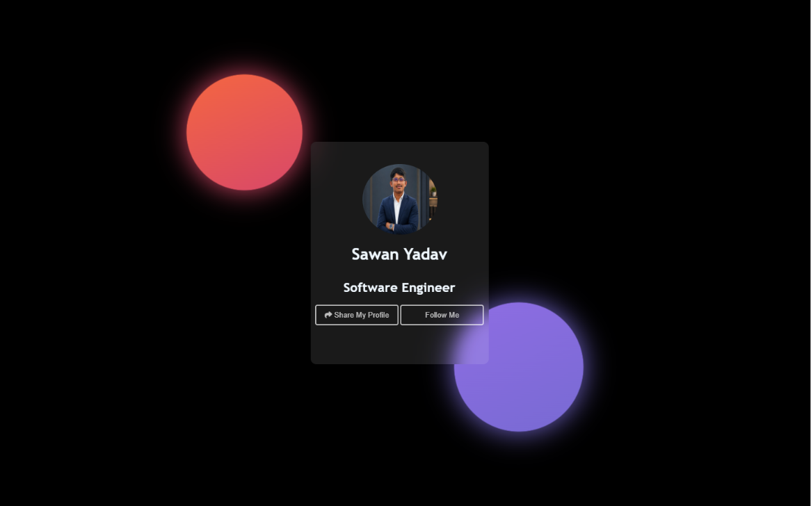

# 👤 Personal Details

A simple and responsive Personal Details webpage built using HTML, CSS, and JavaScript. This project displays personal information in a clean and organized layout.

## 🚀 Live Demo

https://yadavsawan4062-hub.github.io/PersonalDetails/

## 📸 Screenshot



## ✨ Features

* Responsive Design
* Clean User Interface
* Personal Information Display
* Simple Navigation
* Beginner-Friendly Project

## 🛠️ Technologies Used

* HTML5
* CSS3
* JavaScript

## 📂 Project Structure

```text
PersonalDetails/
│
├── index.html
├── style.css
├── script.js
└── assets/
```

## 💻 How to Run

1. Clone the repository

```bash
git clone https://github.com/yadavsawan4062-hub/PersonalDetails.git
```

2. Open the project folder

3. Run `index.html` in your browser

## 👨‍💻 Author

Sawan Yadav

```
```
